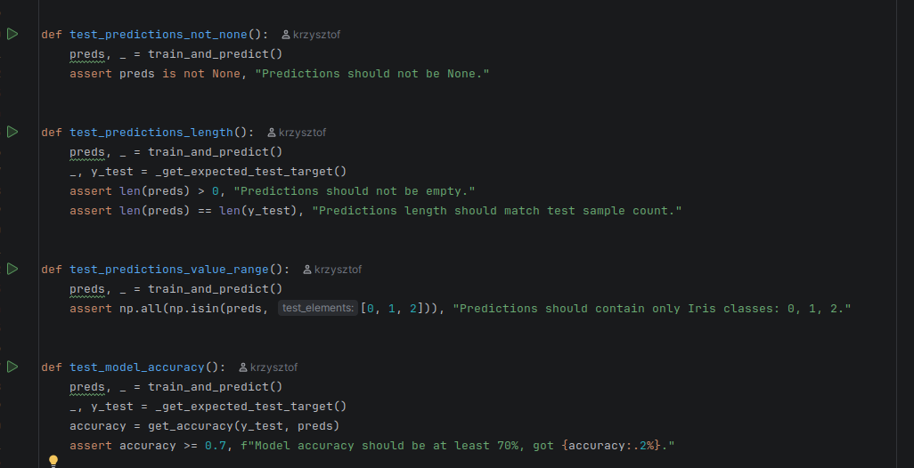
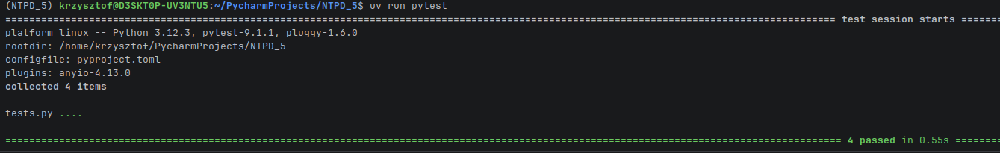
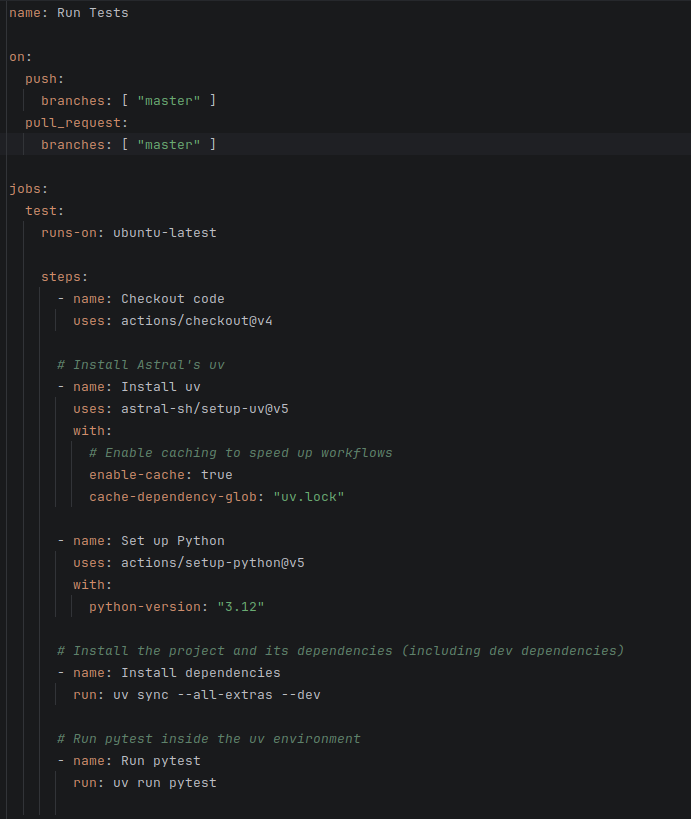
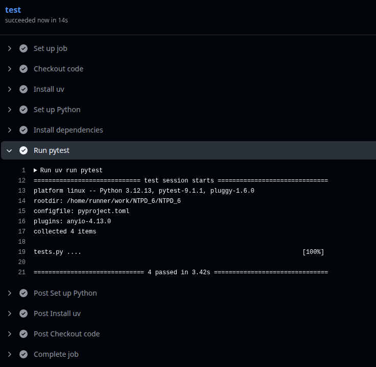

# Lab 6: NTPD

## Zadanie 1: Przygotowanie repozytorium z przykładowym modelem ML

Testy zostały napisane porzy użyciu frameworka `pytest` i znajdują się w pliku `tests.py`

po uruchomieniu testów za pomocą polecenia `uv run pytest` otrzymujemy następujący wynik:

##Zadanie 2: Konfiguracja GitHub Actions do automatycznego testowania

następnie został napisany plik konfiguracyjny `test.yml` w katalogu `.github/workflows`, który zawiera definicję workflow do automatycznego testowania naszego modelu ML przy każdym pushu do repozytorium.

kod został przetestowany lokalnie i działa poprawnie, a następnie został wypchnięty do repozytorium na GitHubie. Po wypchnięciu kodu, GitHub Actions automatycznie uruchomił workflow i wykonał testy.

